# Enter GURPS

Enter GURPS is an informative site that provides a comprehensive short introduction to tabletop role-playing games that newcomers often perceive as daunting. The site targets new players to the tabletop role-playing games and people that are curious about GURPS.  Enter GURPS will be useful for both the new and experienced gamers providing a simplified short explanation of rules, ideas on how to run and play your game, and a pointer to use free resources to help people kick off their first game. 

Whit a short reading time, a visitor to this site can easily decide if the GURPS is a game they want to try out. Information on the site also guides users to easy and comprehensive free official GURPS material that will help them play and test their first game. Examples of different game types on this site give an idea of the potential game and GM (game master) pitch for your players. 

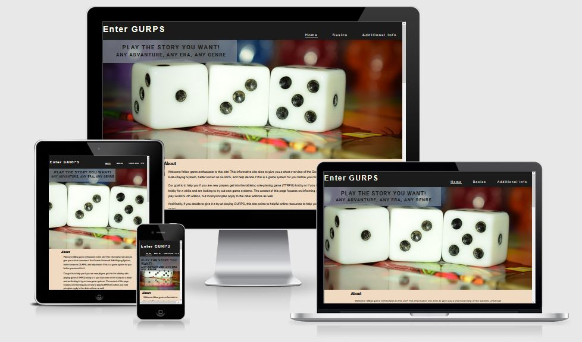

## Features

This informational site has the following features developed to achive the goal of informing the user about a tabletop game while making it easy and comftable to read:

* Hero Image and cover text 
* Header
* Footer
* Informative text and content and comfortable background
* Images that communicate the idea visually
* Links that point to resources and topic of interest

Features are explained in more detail below, as well as future features that are planed to be implemented for this site.

### Hearo Image and cover text

The hero image on this site consists of three six-sided dice representing the signature mechanic of the GURPS system, with an eye-pleasing colored background that feels welcoming. A simple representation of dice is intended to communicate to an aspiring player that this is still a game. Dice being the most commonly used six-sided design would suggest that the content is intended to be light and enjoyable.

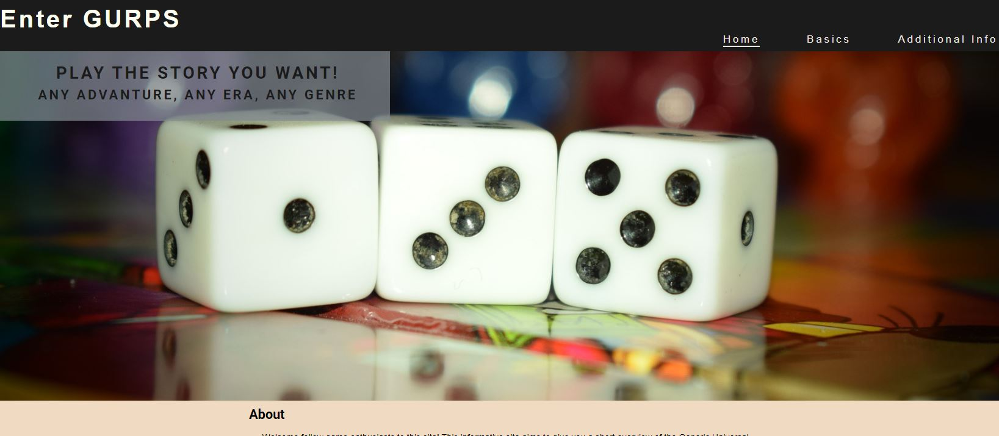

Cover text on the hero image with a transparent background is one of the first things visitors will see. This is the pitch to newcomers. A very short and inspiring speech that tells the user what this site is about in the first 5 seconds. Text and background color scheme for this cover text was selected to be eye-appealing and complimentary with header and hearo image.

### Header

The header contains the site's logo and a nave bar. Header background color (#1b1b1b) has been chosen to compliment the background color of the site. The color scheme of logo and nav bar menu was chosen to be clear and visible on the header background, making it obvious to the user. 

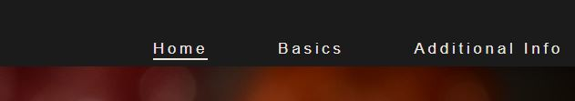

Underline nav bar lists items indicates to users what is the current page that they are reading. The hovering feature helps users tell the page they will click on by displaying an underlined text while hovering with the mouse pointer. 

### Footer

The footer contains four icons to point the user to the social media. Icons have been imported from [Font Awesome](https://fontawesome.com/). The color scheme for icon styling has been selected to compliment the page background and header. The icon size has been styled to be obvious and nicely laid out for all devices. 

The following four social media platform have been chosen, as they represent the best option for gaming community support:
* Facebook - a Facebook group is the most common way to get in touch with the audience, build a community where experiences and ideas are exchanged
* YouTube - a most common platform to communicate information via audio and video. This platform will serve to easily provide examples implemented in a real game as well as a video tutorial. YouTube is also a good platform to host "Ask me anything" videos where the visitors' questions can be answered.
* Pinterest - a simple platform that is used to present the exciting things that we work on our games and share with the rest of the community. 
* Discord - the most common tool used in the gaming community. It is a simple to use platform where the site owner will create a server. Servers is branched in various text and voice channels. Ideal tool for holding a forum-based discussion. These channels can be used as having breakout rooms where the community can discuss specific topic or play a game. This tool will be used to help grow the community, help users of the site answer their questions, and help them get started with a possible online play. 

### Text content and backgroung

Text content has been based on the site author's experience with the GURPS game system. The information has been broken down into small, easy-to-understand sections with the intent to spark curiosity for readers. Text font and color have been choosing to be easy to read. The maximal paragraph width has been selected based on mentor constructive feedback and internet research. The result of the research was a text that easy comfortable to read with a rewarding feeling of progression as the user progresses through the page. 

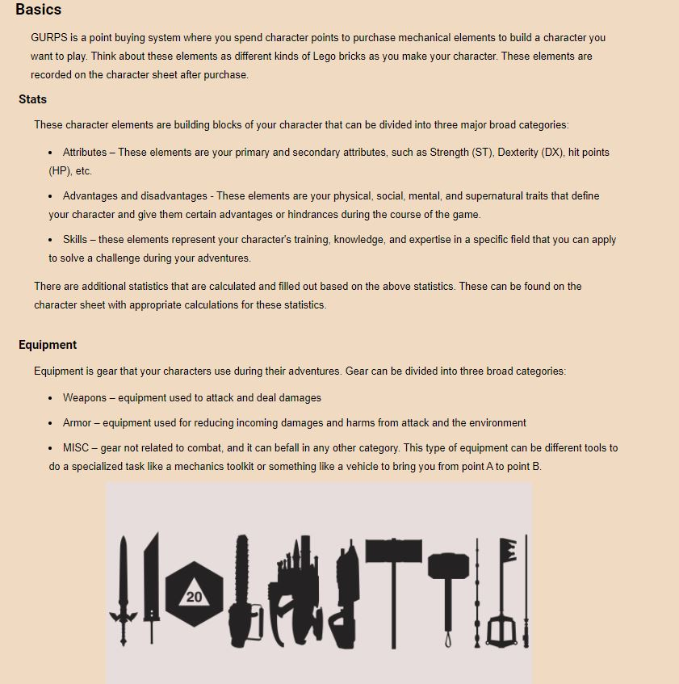

Background color scheme was created to compliment the text and headers using [Adobe Color](https://color.adobe.com/). The color has been optimized to calm the eyes and retain some color resemblance to the [GURPS community forum](https://forums.sjgames.com/forumdisplay.php?f=13). During development, the selected color scheme showed to be more comfortable to look at during long screen time, and the decision was made to keep the current color scheme. 

### Images

Most images were taken from Pixabay (please see credits), while the rest were taken as screenshots from personal campaign material and photos of the books I owned.  
Due to the GURPS flexibility and the message of that flexibility aimed to be communicated, it was hard to find images with a consistent style. Images are carefuly chosen and placed with a systematic intent. 

The first image of a knight on the index page is of a drawing that communicates to the visitor simple visual information on how the system is flexible, who told any additional details on the image that may indicate the game's complexity.  

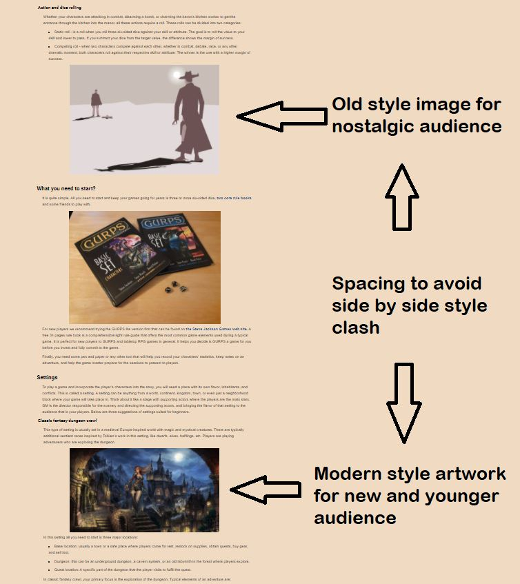

On the basic information page, the first two images contain an art style that appeals more to the audience born during 80's and early 90's, while the last three images appeal more to the audience that prefers the modern art style. The text content between tyle serves as a separation to avoid inconsistency in art while appeasing both user populations. Image of the GURPS books found in the content between these two art styles serves as a natural visual adaptation as the user reads throw the content.

Images on an additional information page were selected to show the user what else is out there and an inspiration to get them to kick off their creative journey. 

### Links

Links on this site can be devided in two broad groups:
* Footer icons - clicable links that point the user to the social media platform
* Text links - links in the text that point the user to the resources

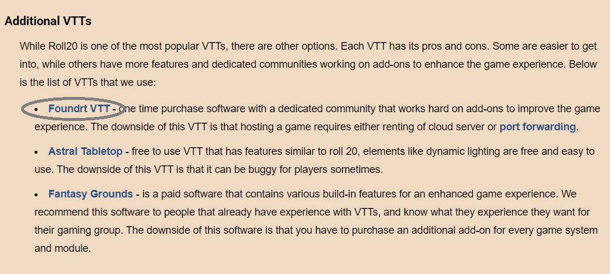

Text links are bolded with a color scheme that makes them stand out from the rest of the text. Colors have been chosen to be obvious and comfortable to read. Text links also have a hovering effect that changes the text's color and shows it in a black box to indicate to the user that they are hovering over the link. All links open a new tab when clicked to keep the user on the current page. 

### Features to implement

Folloging features are planed to be implemented in the future development of this site:
* A dedicated page that will provide more ideas for game settings
* Interactive workbench feature that will help users better understand character creation 
* A mini game tool that will help user learn the basics by tring an easy scenario

## Testing

Testing has been performed before and after site deployment. 

* CSS code has been validated using Jigsaw W3C. Errors encountered were during this validation were blank spaces in font naming. An error has been fixed, and validation has passed.  Additional validation has been performed after deployment as the code was debugged and additional lines added of code added to support smaller screen size.

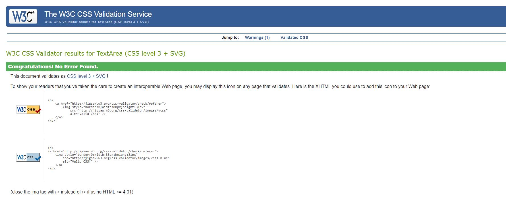

* HTML code for all three pages has been validated using W3C validator – additional code changes have been made to the code to pass the validation. An additional element has been added to hero image section to pass validation and serve as an inspirational text. 

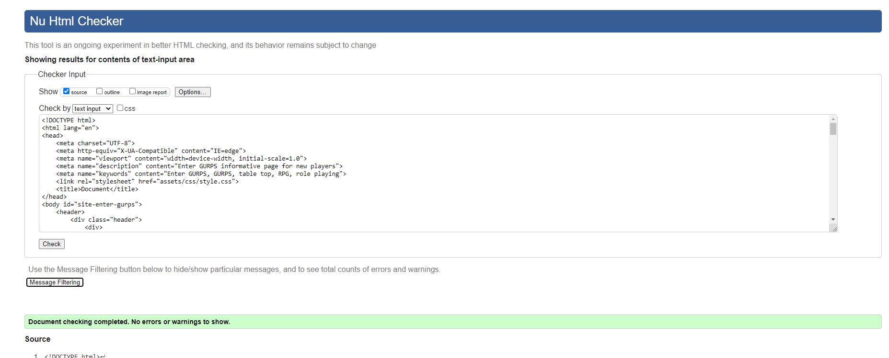

* Unicorn revealer add-on was used to inspect the web page overflow – This tool proved useful during the pre-deployment phase. The majority of the overflow issues during deployment have been encountered around the header and first section area with tablet size screen. The second issue was encountered during the addition of the cover message addition to the hero image.

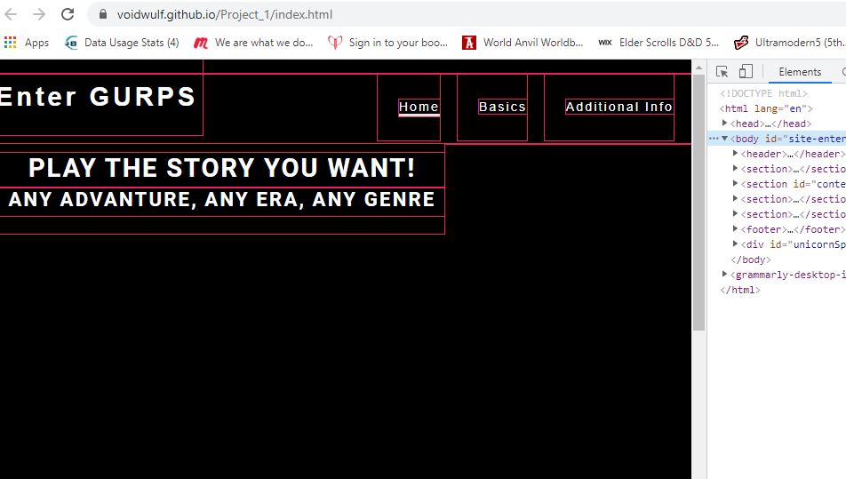

* Google dev tools have been used for debugging issues during the deployment phase. The majority of issues have been related to the image path that was not visible in the pre-deployment phase. Dev tools have also been used to fix the overflow errors before editing the code in the editor.

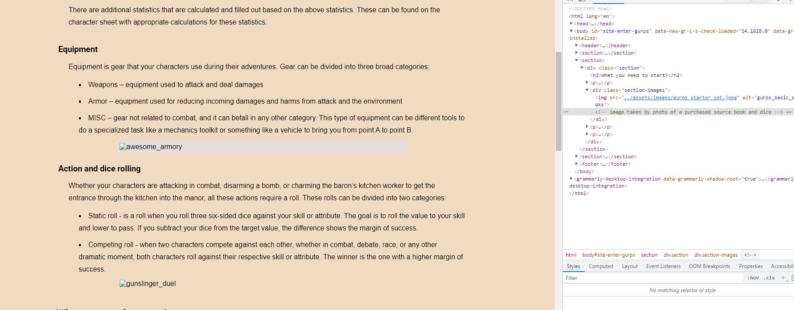

* Lighthouse has been used to assess the usability and performance of the site. For all three pages, one of the issues was the size of the images. Decompression has been performed. 

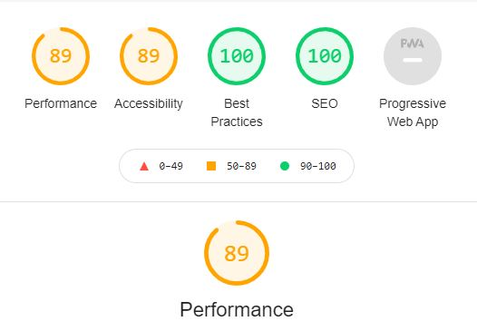
Index page

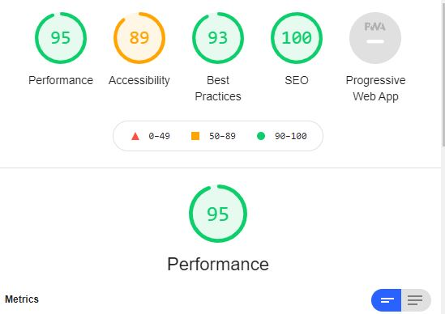
Basics page

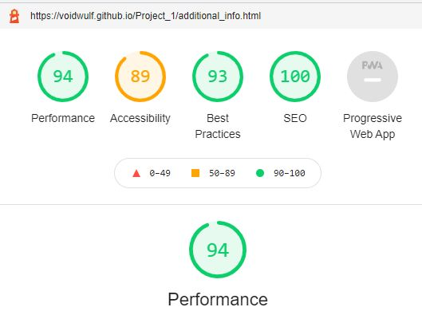
Additional information page

Additional issues need to be fixed to improve usability ( edit ccs code), which is left to resolve later due to time limitations. Other areas of improvement are related to reducing the overflow of elements. 

## Deployment

## Credits

For the creation of this site, there are many sources that deserve credit for making this informative site possible. Bellow are accreditations to the sources and feedback that was used as the input to create this site.

### Text content

Big shout out to the following sources for the text content:

* [GURPS 4th edition Basic Set](http://www.sjgames.com/gurps/) book for inspiring most of the informative content.
* [Wikipedia](https://www.wikipedia.org/) for information on virtual table top platforms.
* [DUNGEONFOG](https://www.dungeonfog.com/) for introductory information on DUNGEONFOG mapping platform. 

#### Technology
Special thanks to the following provider for helping to inspect the content:
* [Grammarly](https://grammarly.com/) application used for inspection of grammer and spelling error.

### Styling

#### Styling code
For inspiration of style for this page that breathing it to the ready state for deployment, a big shout out to:
* Code Institute [Lover running](https://github.com/Code-Institute-Org/love-running-2.0) for ispiring work on logo, header and footer.
* [D&D Beyond](https://www.dndbeyond.com/) for inspiration on paragraph width that provides more user-friendly and rewarding reading through the informative text.
* [CAREER KARMA](https://careerkarma.com/blog/css-box-model/) for inspiration on the section division code for a more eye-appealing reading of the informative text.

#### Technology

The following technology was used to help style the site:
* [Google Fonts](https://fonts.google.com/)  for complimentary font selection and importin of fonts into the CSS code.
* [Unicon Revealer](https://chrome.google.com/webstore/detail/unicorn-revealer/lmlkphhdlngaicolpmaakfmhplagoaln?hl=en-GB) add-on that was a great help for inspection of overflow of the site.
* [Adobe Color](https://color.adobe.com/) for selection of complementary colors used for text, background, headers, and icons. This tool helped to style the site to a more comfortable reading with less eye strain.

#### Feedback

Feedback from following people helped in developing styling for this site:
* [Aaron Sinnott](https://github.com/aaronsnig501) for constructive feedback on paragraph style for informative text and link styling.  This inspired research that broth the styling content to the current stage.

### Images

Most of the images have been aqured from [Pixabay](https://pixabay.com/). 
Big shout out to:
* [adrikaszabo](https://pixabay.com/users/adrikaszabo-9453374/) for a beautiful three dice image that is used as a hero image for this site.
* [PhoenixRisingStock](https://pixabay.com/users/phoenixrisingstock-21967857/) for a post-apocalypse image that helps visually communicate one of the possible survival game .settings to new players.
* [jcoope12](https://pixabay.com/users/jcoope12-17392968/) for fantasy city image that helps visually communicate one of the possible fantasy game settings to new players.
* [Baggep](https://pixabay.com/users/baggeb-15600954/) for the cyberpunk image that helps visually communicate one of the possible fantasy game settings to new players.
* [DanXaw](https://pixabay.com/users/danxaw-9189893/) for dystopian knight image used on the index page that help communicate the flexibility of GURPS system.
* [signs4fun](https://pixabay.com/users/signs4fun-5074226/) for image of weapons displayed in early 2000's style that helps communicate various options with a touch of nostalgi.
* [OpenClipart-Vectors](https://pixabay.com/users/openclipart-vectors-30363/) for an image of a duel that communicates tension and drama that players can experience during their game.
* [ProFantasy](https://www.profantasy.com/products/cc3.asp) team that developed Campaign Cartographer software used for building maps for my campaigns used as examples on this site.
* [Roll20](https://roll20.net/) virtual table top platform where one of my active campaign is used as a sample to provide informative visual information to newcomers to the hobby.
* [DUNGEONFOG](https://www.dungeonfog.com/) mapmaking site that I use to build maps for my campaign and use a screenshot of the same as an example for new players and GMs. 
